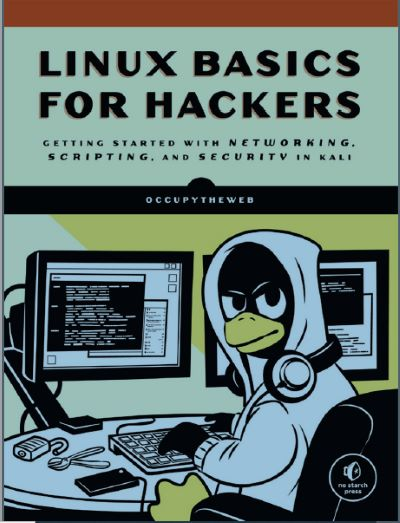

# Github Docs Example2023

## Writing good documentation
### Step 1 - Using codeblocks

- Codeblocks in markdown make it *very easy* for tech people to **copy, paste,share code**. A good __Cloud Engineer__ uses codeblocks whenever possible because it allows others to copy and paste their code to replicate/ research issues.

- A code block in Golang
```
package main

import (
	"fmt"
	"os"
)

func main() {
	// Deliberate Error: Trying to open a non-existent file
	file, err := os.Open("non_existent_file.txt")
	if err != nil {
		fmt.Println("Error:", err)
		return
	}

	defer file.Close()

	// Attempting to read from the file
	data := make([]byte, 100)
	_, err = file.Read(data)
	if err != nil {
		fmt.Println("Error:", err)
	}
}
```

- When you can, try to apply syntax highlighting to code bloacks
```go
package main

import (
	"fmt"
	"os"
)

func main() {
	// Deliberate Error: Trying to open a non-existent file
	file, err := os.Open("non_existent_file.txt")
	if err != nil {
		fmt.Println("Error:", err)
		return
	}

	defer file.Close()

	// Attempting to read from the file
	data := make([]byte, 100)
	_, err = file.Read(data)
	if err != nil {
		fmt.Println("Error:", err)
	}
}
```

- How to add images 1


- How to add images 2


- Using a codeblock to show an error that appears in bash
```golang
Error: division by zero is not allowed
```
> Shows an error in golang

### Step 2 - How to take screenshots
- A screenshot is when we take a photo of our work envronment/code.

**DONT DO THIS**


You can take screenshots on both Mac and Windows using hotkeys. Here are the common hotkeys for taking screenshots on both operating systems:

**DO THIS INSTEAD**
- To take screenshots, do the following on either MAC or Windows.
  
**On Mac (macOS):**

1. **Capture the Entire Screen:** Press `Command (⌘) + Shift + 3`. The screenshot will be saved to your desktop by default.

2. **Capture a Selected Portion of the Screen:** Press `Command (⌘) + Shift + 4`, then use your mouse to select the area you want to capture. The screenshot will be saved to your desktop.

3. **Capture a Specific Window:** Press `Command (⌘) + Shift + 4`, then press the `Spacebar`. Your cursor will turn into a camera icon. Click on the window you want to capture. The screenshot of that specific window will be saved to your desktop.

**On Windows:**

1. **Capture the Entire Screen:** Press `PrtScn` (Print Screen) key. The screenshot is copied to your clipboard, and you can paste it into an image editor like Paint or a document.

2. **Capture the Active Window:** Press `Alt + PrtScn`. This captures only the currently active window and copies it to your clipboard.

3. **Capture a Selected Portion of the Screen (Windows 10 and later):** Press `Win + Shift + S`. This opens the Snip & Sketch tool, allowing you to select a portion of the screen. The screenshot is copied to your clipboard.

4. **Capture a Specific Window (Windows 10 and later):** Press `Alt + Tab` to switch between open windows. While holding `Alt`, press `PrtScn` to capture the currently selected window. The screenshot is copied to your clipboard.

5. **Using Snipping Tool (Windows 7 and 8):** You can use the Snipping Tool application. Open it, select the type of snip you want (e.g., Free-form Snip, Rectangular Snip), capture the screen area, and then save the screenshot.

6. **Using Snip & Sketch (Windows 10 and later):** You can use the Snip & Sketch app, which provides more advanced screenshot options. Press `Win + Shift + S` to open it and capture a portion of the screen.

Remember that the exact key combinations or methods may vary slightly depending on your specific Windows version. Additionally, on Windows, the screenshots are usually copied to the clipboard, so you need to paste them into an application (e.g., Paint, Word, or an image editor) to save or edit them.

### Step 3 - Use Github Flavored Markdown Task lists

- Github extends markdiown to have a list where you can check off items. [<sup>[3]</sup>](#references)
- [x] Finish step 1
- [ ] Finish step 2
- [x] Finish step 3

### Step 4 - Use Emojis (Optional)

- Github Flavoured Markdown (GFM) supports emoji shortcodes.
- Here are some examples:

| Name | Shortcode | Emoji |
| --- | --- | --- |
| Cloud | `:cloud:` | :cloud: |
| Cloud | `:cloud_with_lightning:` | :cloud_with_lightning: |

### step 5 - How to create a Table
- You can use the following markdow to create tables:

```markdown
| Name | Shortcode | Emoji |
| --- | --- | --- |
| Cloud | `:cloud:` | :cloud: |
| Cloud | `:cloud_with_lightning:` | :cloud_with_lightning: |
```

- Github allows us to extend the functionality of Markdown tables to provide more alignment and table cell formatting options. [<sup>[4]</sup>](#references)


[Secret Window Hidden Garden](secret-window/hidden-garden.md)

### References
- [Learn Git Branching](https://learngitbranching.js.org/) <sup>[1]</sup>
- [Git --fast-version-control](https://git-scm.com/book/en/v2) <sup>[2]</sup>
- [Github Flavoured Markdown - Task lists](https://docs.github.com/en/get-started/writing-on-github/working-with-advanced-formatting/about-task-lists) <sup>[3]</sup>
- [Github Flavoured Markdown - Emoji Cheatssheet](https://github.com/ikatyang/emoji-cheat-sheet/blob/master/README.md)
- [Github Flavoured Markdown - Tables(with extensions)](https://github.github.com/gfm/#tables-extension) <sup>[4]</sup>
